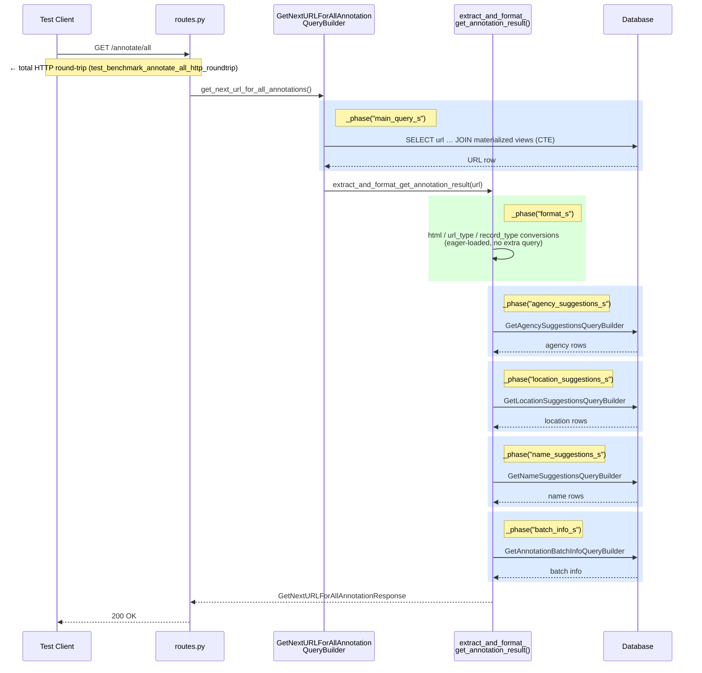

# Annotation Load Time Benchmarks

Baseline benchmarks for the `GET /annotate/all` endpoint (issue #566).
Run manually or via the [`benchmark` GHA workflow](../../../../.github/workflows/benchmark.yml).

## What is measured



Each shaded block corresponds to a `_phase()` context manager in the source.
The per-phase timings are collected via `AnnotationTimings` / `collect_timings()`
from `src/api/endpoints/annotate/_shared/timing.py` — zero-cost in production
when no collector is active.

## Running locally

```bash
POSTGRES_USER=test_source_collector_user \
POSTGRES_PASSWORD=HanviliciousHamiltonHilltops \
POSTGRES_DB=source_collector_test_db \
POSTGRES_HOST=127.0.0.1 \
POSTGRES_PORT=5433 \
GOOGLE_API_KEY=TEST \
GOOGLE_CSE_ID=TEST \
uv run pytest tests/automated/integration/benchmark \
  -m "manual and benchmark" \
  --benchmark-json=benchmark-results.json \
  -v
```

## Comparing runs

```bash
uv run pytest-benchmark compare baseline.json new-results.json --sort=mean
```
